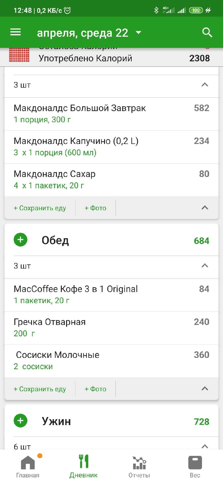

# Работу выполнил Кацков Павел ИПБ-16

# Направление

Для проекта было выбрано направление Observation. Основная задача будет заключаться в отображении необходимой информации, возможности удобно и быстро осуществлять необходимые действия.

# Цель

Цель наблюдения - выявление насколько удобно людям организовывать управление своим питанием, а также узнать, сколько требуется времени на организацию закупок продуктов. В текущее время мало людей контролирует свое питание, т.к. следить за потреблением калорий, белков, жиров, углеводов (КБЖУ), микро и макро элементов сложно. Еще сложнее планировать свой процесс питания с учетом привычек, вкусов и сбалансированности употребляемых продуктов и блюд. 

# Основные параметры опрашиваемых

Список параметров:

1. Возвраст
3. Частота походов в магазин
4. Время на поход в магазин (дойти, все выбрать и купить, вернуться)
5. Средний чек

# Характеристика опрашиваемых

1. 22 года. Раз в сутки. 30 минут. 200 рублей.
2. 23 года. Раз в двое суток. 30 минут. 500 рублей.
3. 21 год.  Раз в сутки. 15 минут. 300 рублей.
4. 22 года. Раз в трое суток. 30 минут. 700 рублей.

# Наблюдения

Человек А занимается спортом и хочет организовать себе здоровое питание. Ранее мало готовил и только примерно слышал о полезности или вреде конкретных продуктов. Не умеет составлять сбалансированные планы питания. Также не умеет эффективно расходовать деньги в магазине.
Чтобы начать отслеживать свое питание начал использовать приложение fatsecret. Его удобство заключается в том, что уже имеется база продуктов и блюд в которой можно найти часто употребляемые продукты, а для продуктов указаны КБЖУ, где у некоторых также микро и макроэлементы. Но наличие этого приложения только позволяет следить, но никак не планировать свое питание с учетом вкусов, сбалансированности и доступности продуктов.
Основные экраны приложения ниже:

Изображение 1. Экран дневника питания. Употребленные продукты и блюда с учетам их калорий.

Изображение 2. Экран страницы с отчетом. Указана сводка за день в виде употребленных КБЖУ, микро а макроэлементов. 

Человек Б хочет управлять своим питанием, т.к. имеет избыточный вес и проблемы со здоровьем (гипертония). В данном случае человеку важно планировать свое питания, чтобы поддерживать свое здоровье. Необходимо Подбирать продукты и блюда таким образом, чтобы в организме создавался дифицит калорий для уменьшения веса, а также было достаточно микро и макро элементов (например, таких как магний и калий). Для решения своих проблем человек Б пытался искать продукты и планы питания в интернете, выписывал хим. состав продуктов и пытался спланировать что нужно сукшать. Оказалось, что вручную это делать очень сложно, т.к. постоянно нужно пересчитывать множество параметров. Более того, после недельного перерыва в контроле, приходится начинать все заново.

В обоих случаях оба человека столкнулись со следующими проблемами:

1. Необходимость каждый прием пищи учитывать количество употребленных продуктов (иногда еще и пересчитывать КБЖУ)
2. Необходимость постоянной работы с отчетами - нужно отслеживать нет ли превывышения или недобора по каким-то компонентами продуктов
3. Необходимость планирования своего питания как на день, так и на неделю
4. Отсутствие желания есть запланированную еду, т.к. она не соответствует вкусу (например, запланирована геркулесовая каша, но человеку не нравится ее вкус), что может мотивировать человека нарушить правила и съесть что-то более вкусное, но не сбалансированное
5. Сложно планировать, т.к. в магазинах большой асортимент товаров (подходить к каждому и смотреть его КБЖУ микро и макроэлементы практически не возможно)
6. Приходится самому искать продукты, которые могут понравится по вкусу и буду вписываться в план питания

Для решения проблемы контроля и планирования питания был предложен проект. 

# Описание проекта

Предполагается реализация приложения для наиболее часто используемых платформ: PC(Windows, Linux, MacOS), Mobile(Android, iOS), Web.
В задачи приложения будет входить следующее:

1. База данных продуктов с информацией о их хим. составе - КБЖУ, микро/макро элементы.
2. Дневник питания с учетом состава употребленных продуктов и учет потребления от рекоммендуемой суточной нормы (РСН)
3. Отчеты (процент потребления веществ от РСН)
4. Уведомления о событиях (достижения РСН по веществам, несоблюдение сроков приема пищи, превышения по веществам)
5. Рекомендации на основании истории потребления веществ и их процента от РСН
6. Группировка продуктов в рецепты блюд
7. Интеграция с интернет магазином продуктов

# Аналоги

1. Fatsecret - мобильное приложение для Android. Позволяет вести дневник питания, генерирует отчеты и имеет базу данных с продуктами. Не умеет давать рекомендации, а также не имеет интеграции с реальным магазином.
2. Balance - мобильное приложение для Android. Позволяет вести дневник питания, генерирует простые отчеты и имеет базу данных с продуктами, а также позволяет создавать рецепты блюд. Не умеет давать рекомендации, учитывает только КБЖУ, а также не имеет интеграции с реальным магазином.
3. FoodDiary - мобильное приложение для Android. Позволяет вести дневник питания, учитывать тренировки и количество выпитой воды. Не умеет давать рекомендации, нет базы данных, не имеет интеграции с реальным магазином, а также нет версии для других платформ.

# План опроса

1. Имеется ли у вас избыточный вес?
2. Имеются ли проблемы со здоровьем?
3. Занимаетесь ли спортом?
4. Как часто самостоятельно готовите?
5. А как часто заказываете готовую еду?
6. Считаете ли важным котроль питания?
7. Считаете свое питание сбалансированным?
8. Пытались ли ранее заняться контролем своего питания?
9. Хотели бы организовать себе сбалансированное питание?
10. Почему не получилось?
11. Что в этом самое сложное?

Результат опроса:

___

## Человек 1.

1. Имеется ли у вас избыточный вес? - да
2. Имеются ли проблемы со здоровьем? - да
3. Занимаетесь ли спортом? - иногда, скорее нет
4. Как часто самостоятельно готовите? - когда приходится
5. А как часто заказываете готовую еду? - редко
6. Считаете ли важным котроль питания? - очень важно
7. Считаете свое питание сбалансированным? -  могу сделать балансированным когда есть настроение, но чаще конечно же нет
8. Пытались ли ранее заняться контролем своего питания? -  2 раза по месяцу в течении года, результат был просто огонь
9. Хотели бы организовать себе сбалансированное питание? - помощь в этом была бы мне удобна
10. Почему не получилось? -  когда правильно питался сталкнулся с эффектом плато в весе, не знал как его сдвинуть, упала мотивация
11. Что в этом самое сложное? - удержать себя первую неделю, дальше легко

___

## Человек 2.

1. Имеется ли у вас избыточный вес? - Нет
2. Имеются ли проблемы со здоровьем? - Экзема, и давление в ушах
3. Занимаетесь ли спортом? -  да
4. Как часто самостоятельно готовите? - Только что готовил (каждый день)
5. А как часто заказываете готовую еду? - раз-два в неделю
6. Считаете ли важным котроль питания? - да
7. Считаете свое питание сбалансированным? -  относительно, стараюсь есть чаще полезную еду
8. Пытались ли ранее заняться контролем своего питания? -  да
9. Хотели бы организовать себе сбалансированное питание? - думаю да
10. Почему не получилось? -  не было продуктов или денег
11. Что в этом самое сложное? - придумать что есть

___

## Человек 3

1. Имеется ли у вас избыточный вес? - да
2. Имеются ли проблемы со здоровьем? - гипертония
3. Занимаетесь ли спортом? -  очень редко
4. Как часто самостоятельно готовите? - несколько раз в неделю
5. А как часто заказываете готовую еду? - два-три раза в неделю
6. Считаете ли важным котроль питания? - очень важно
7. Считаете свое питание сбалансированным? - абсолютно нет
8. Пытались ли ранее заняться контролем своего питания? -  да
9. Хотели бы организовать себе сбалансированное питание? - да
10. Почему не получилось? -  сложно, не хватило самодисциаплины
11. Что в этом самое сложное? - самодисциалина

___

## Человек 4

1. Имеется ли у вас избыточный вес? - да
2. Имеются ли проблемы со здоровьем? - да
3. Занимаетесь ли спортом? -  на карантинте пытаюсь, до карантина да
4. Как часто самостоятельно готовите? - часто
5. А как часто заказываете готовую еду? - не часто, но можно реже
6. Считаете ли важным котроль питания? - да, если есть цель контроля веса
7. Считаете свое питание сбалансированным? - нет
8. Пытались ли ранее заняться контролем своего питания? -  да
9. Хотели бы организовать себе сбалансированное питание? - можно, но сложно
10. Почему не получилось? -  надоело постоянно записывать приёмы пищи
11. Что в этом самое сложное? -самостоятельный подсчёт калорий

# Анализ опроса

По опросу можно сделать следующие выводы:

1. У большинста людей имеется либо избыточный вес либо проблемы со здоровьем
2. Большинство редко занимается спортом
3. Большинство часто готовит самостоятельно
4. Люди заказывают пищу в среднем 1-2 раза в неделю
5. Абсолютно все считают контроль питания важным
6. Мало кто считает что контролирует свое питание
7. Все ранее пытались организовать контроль питания
8. У всех была причина забросить контроль питания

